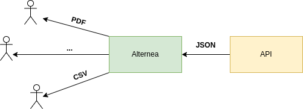

[TOC]

# Alternea - polymorphic API wrapper

Add new functionality to your API with just a few lines of code



It comes with a proxy that forwards clients to backend services and a transformation engine with which you can alter
the response data.

Alternea helps solve problems when a task requires providing data in a certain form for an already existing API. 
For example, to generate various statements, export data, reports, and more.

## Configuration

During initialization, the service loads a configuration file.
By default, it is the `alternea.hcl` file, which is located in the same directory as the executable.
In order to specify another configuration file, you can define the ALTERNEA_CONFIG environment variable in which to
specify the path to the file.

### Structure

The configuration structure consists of blocks and attributes. Blocks are containers for defining related entities.

```hcl
// block
server "arbitrary name" {
  // attribute
  listen = "127.0.0.1:8080"
  // nested block
  service_proxy "/some/path" {
    // ...
  }
}
```

### Built-in functions

#### duration("1m")

Parses a duration string such as "300ms", "-1.5h" or "2h45m".
Valid time units are "ns", "us" (or "µs"), "ms", "s", "m", "h".

#### env("ENV_NAME", \["default value"\])

Retrieves the value of the environment variable named by the key.
If the variable is not present then optional default value is returned.

#### fromFile("/path/to/file.txt")

Reads the named file and returns the contents.

#### unmarshalJSON("{\\"key\\":\\"value\\"}")

Parses the given JSON string and, if it is valid, returns the value it represents.

### Root Block

The root block is an area of the configuration file that is not nested within other blocks.

```hcl
// determines the verbosity level of logging
// possible values from the most verbose to the quietest: debug, info, warn, error
log_level = "warn" // optional, default is "info"
```

### Server Block (belongs to the root block)

Defines a set of parameters and services to serve HTTP requests.

```hcl
server "main" {

  // specifies the TCP address for the server to listen on in the form "host:port".
  listen = "127.0.0.1:8080" // required

  // read_timeout is the maximum duration for reading the entire
  // request, including the body.
  read_timeout = duration("1m") // optional, default is infinite

  // is the maximum duration before timing out  
  // It is reset whenever a new request's header is read. 
  write_timeout = duration("30s") // optional, default is infinite

  // idle_timeout is the maximum amount of time to wait for the
  // next request when keep-alives are enabled. If idle_timeout
  // is not set, the value of read_timeout is used. If both are
  // not set, there is no timeout.
  idle_timeout = duration("30s") // optional

  //...
}
```

### Proxy Service Block (belongs to the server block)

Defines a proxy service.

```hcl
// ...
server "main" {
  // ...
  // for routing details see *Routes Matching Rules* section below
  proxy_service "/pdf/author/:id/books" {
    // defines endpoint settings (required)
    backend {
      // specifies endpoint url
      target_url = "https://example.com/author/:id/books" // required

      // determines which codes to consider successful, if the end server responds with one of the listed codes, 
      // then alternea continues processing the response data, otherwise the original response is 
      // transmitted to the client
      success_http_status_codes = [200, 206] // optional, default [200]
    }

    // defines the HTTP method by which the client should request this service (involved in route matching)
    method = "GET" // optional, default "GET", available methods are: GET, POST, PUT, PATCH, DELETE

    // set_header allows to set HTTP headers    
    set_header = {
      // optional
      Content-Type        = "application/pdf"
      Content-Disposition = "attachment; filename=books.pdf"
    }

    // flush_interval specifies the flush interval
    // to flush to the client while copying the
    // response body.
    // If zero, no periodic flushing is done.
    // A negative value means to flush immediately
    flush_interval = duration("500ms") // optional

    // defines the transformations to be applied to the response data
    // available transformers are described below
    transformer "{transformer name}" {
      // required
      // ... 
    }

  }
  // ...
}
```

### Transformer PDF (belongs to the proxy_service block)

Generates a PDF file from an HTML template using response data.

To use this transformer, it is required that [wkhtmltopdf](https://wkhtmltopdf.org/) "full" be installed.


```hcl
// ...
server "main" {
  // ...
  proxy_service "/pdf/author/:id/books" {
    // defines the transformations to be applied to the response data
    transformer "pdf" {
      // template is processed by [Golang template engine](https://pkg.go.dev/html/template)
      // the response data is available in the template under the .Data property
      template = fromFile("my-template.html") // required

      // before passing the data to the template, they can be preprocessed
      // by optionally defining "remapper"
      remapper = {
        // available remappers are described below
        name = "{remapper name}"
        // ...
      }
    }
  }
  // ...
}
```

### Transformer CSV (belongs to the proxy_service block)

Transforms data to CSV

This transformer expects data in the form of a JSON object in which property names are interpreted as column names
object property values must be an array in which each element is interpreted as a cell value.

Example:

```json
{
  "first name": [
    "Alan",
    "Tim",
    "Linus"
  ],
  "second name": [
    "Turing",
    "Berners-Lee",
    "Torvalds"
  ]
}
```

(first line the "header" is optional, determined by the use_header setting)

```csv
first name, second name
Alan, Turing
Tim, Berners-Lee
Linus, Torvalds
```

Use "remapper" to bring the data into the required form.

```hcl
// ...
server "main" {
  // ...
  proxy_service "/csv/author/:id/books" {
    // this transformer expects data in the form of a JSON object 
    // in which property names are interpreted as column names
    // the object property values must be an array in which each element is interpreted as a cell value
    transformer "csv" {
      // use_header set to true to use header as a first line (column names)
      use_header = true // optional, default false

      // delimiter specifies delimiter character
      delimiter = ";"  // optional, default ","

      // use_crlf set to true to use \r\n as the line terminator
      use_crlf = true // optional, default false

      // tablifier transforms incoming data into a tabular form ([][]string)
      // required by the "csv" transformer
      tablifier = {
        name = "json" // the only available tablifier for now is json

        // before passing the data to the tablifier, they can be preprocessed
        // by optionally defining "remapper"
        remapper = {
          // available remappers are described below
          name = "{remapper name}"
          // ...
        }
      }

    }
  }
  // ...
}
```

### Remapper

Remapper allows alternea to prepare data (change the structure, rename, etc.)  before using it in a transformer.

#### Kazaam remapper

Based on the [https://github.com/qntfy/kazaam](https://github.com/qntfy/kazaam)
> Kazaam was created with the goal of supporting easy and fast transformations of JSON data

```hcl
// ...
remapper = {
  name = "kazaam"
  // heredoc syntax of HCL
  spec = <<-SPEC
[
  {
    "operation": "shift",
    "spec": {
      "id": "data[*].id",
      "numMp": "data[*].title"
    }
  }
]
SPEC
}
// ...
```

Please follow the  [link](https://github.com/qntfy/kazaam) for information regarding the specs.

### Static Service Block

Static service provides functionality for serving static content.

```hcl
// ...
server "main" {
  // ...
  static_service "/health-check" {
    // defines the HTTP method by which the client should request this service (involved in route matching)
    method = "GET" // optional, default "GET", available methods are: GET, POST, PUT, PATCH, DELETE
    
    // response_code sets HTTP response status code
    response_code = 200 // required
    
    // set_header allows to set HTTP headers, optional
    set_header    = {
      X-My-Custom-Header = "custom header"
    }
    
    // content specifies response content
    content = "Hello!" // optional
  }
}
```


## Routes Matching Rules

Routes are matched according to the following rules:

The request path is first checked for identity "/some/path" == "/some/path".
If the paths do not match then the segments are checked (content between the path separator characters '/' is called a
segment)

* \* - matches anything in the segment "/some/*/path"
* | - a separator to indicate one of the possible options "/book/authors|comments" means that the match will be in 2
  cases "/book/authors" or "/book/comments"
* :arbitraryName - named segment, behaves the same as a wildcard, but allows you to substitute the content of the
  segment in the target url using the same name.
* ** - skipping the rest, for example "/api/v1/**" will match any path that starts with "/api/v1/". Named segments
  cannot be used after this entry.

## Example run with docker

Building image:

```shell
docker build . -t alternea
```

Run with sample configuration:

```shell
docker run -p 8080:8080 -v $(pwd)/alternea.sample.hcl:/app/alternea.hcl -v $(pwd)/shift.sample.spec.json:/app/shift.sample.spec.json alternea
```

2 endpoints should be available on port localhost:8080

* GET http://localhost:8080/csv/posts
* GET http://localhost:8080/health-check


## TODO

* TLS
* Control over requests
* More options
* Docs
